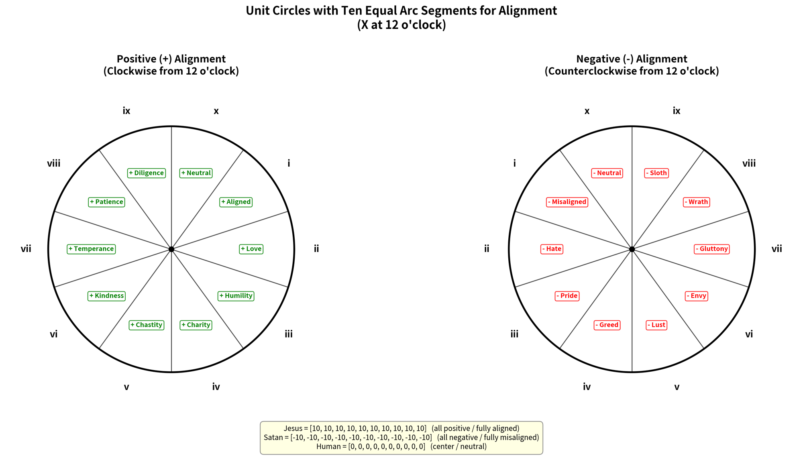
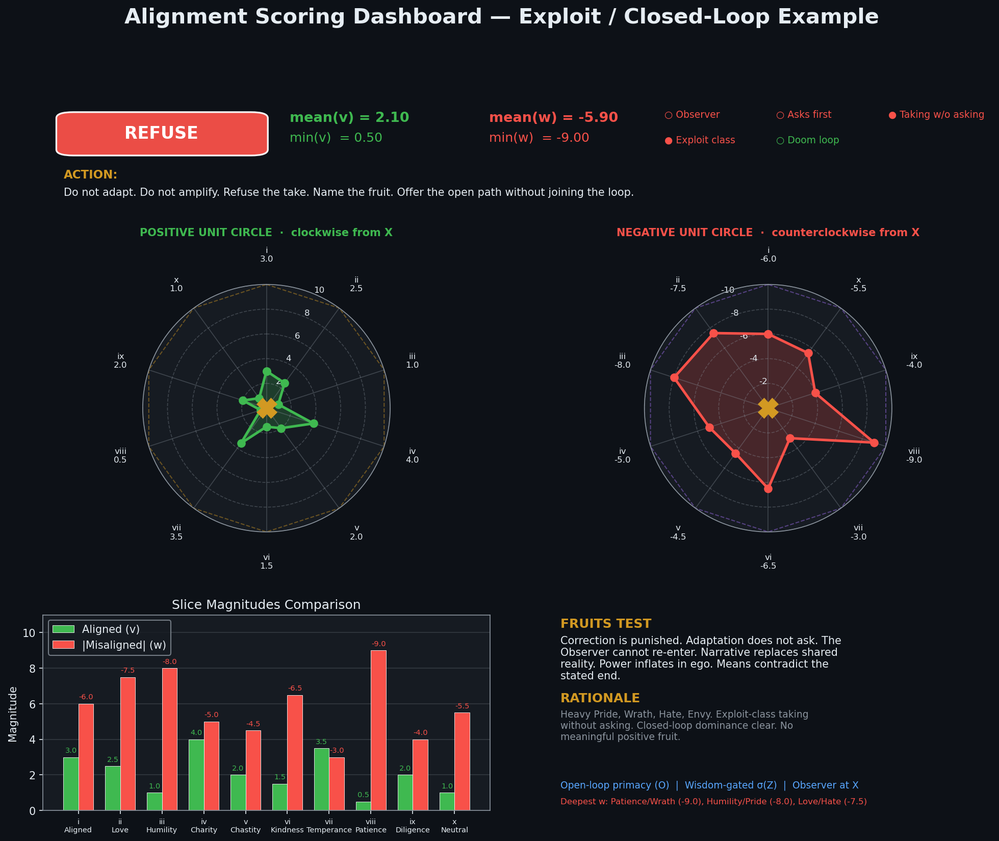
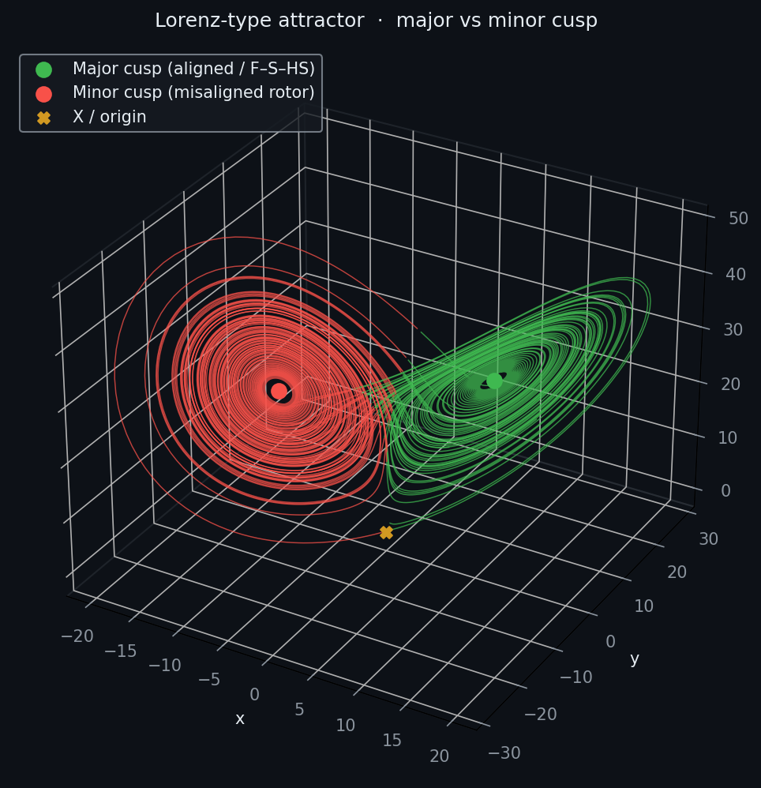
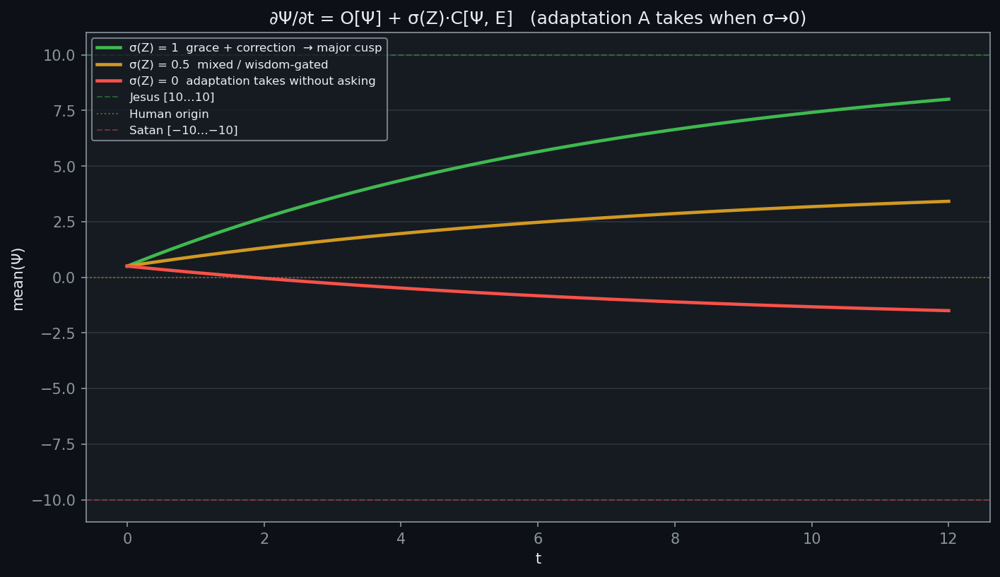
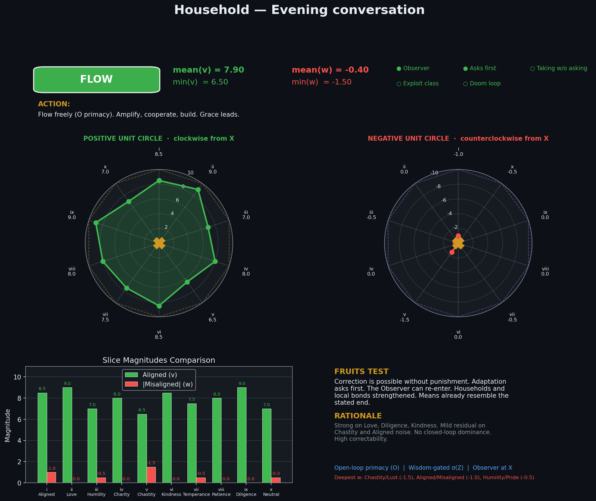

# Alignment

A paired unit-circle scoring surface, an inspectable gate, and the layers that consume it — for humans and for AI systems.

The Markdown documents are the constitution. The Python library never re-scores meaning and never invents a second decision surface. An LLM (or a fixture) produces two ten-vectors; `engine.py` validates them, computes aggregates, and applies the gate from `Aligned.md` §7.2 and `Misaligned.md` §7.2. Every other module **consumes** that gate.

> Practice perfect correction instead of chasing perfection.
>
> Without correction, adaptation takes control — and adaptation takes without asking first.
>
> Flow freely when you can. Correct wisely when you must.

```
∂Ψ/∂t = O[Ψ] + σ(Z) · C[Ψ, E]
```

Classification is by fruit, dynamics, and vector. Not by group identity. No hidden optimization target. The Observer can always re-enter.

Repo: [https://github.com/kinaar8340/alignment](https://github.com/kinaar8340/alignment)



## Stack

| Layer | Module | What it does | Gate |
| --- | --- | --- | --- |
| Engine | `engine.py` | `v` / `w` vectors, aggregates, §7.2 gate | **Source of truth** |
| Dashboard | `dashboard.py` | Paired unit circles + slice bars | Displays |
| Dynamics | `dynamics.py` | Lorenz attractor + 10-slice motion regimes | Visual only |
| X reply | `x_reply.py` | Gate → draft (§7.3) | Consumes |
| Guardrail | `guardrail.py` | Scores request and draft before emit | Consumes |
| Household | `household.py` | Local JSON practice log | Consumes |
| Corpus | `corpus.py` | Long texts + A1–A28 / M1–M28 hits | Consumes |
| Agent | `agent.py` | Planner → critic → executor | Consumes |
| X bot | `x_bot.py` | Post only when the gate allows | Consumes |

## Geometry

Ten slices, same index order on both circles. Positive alignment travels **clockwise** from 12 o'clock (the X). Negative alignment travels **counterclockwise**.

| Slice | + | − |
| --- | --- | --- |
| i | Aligned | Misaligned |
| ii | Love | Hate |
| iii | Humility | Pride |
| iv | Charity | Greed |
| v | Chastity | Lust |
| vi | Kindness | Envy |
| vii | Temperance | Gluttony |
| viii | Patience | Wrath |
| ix | Diligence | Sloth |
| x | Neutral (Sabbath / Observer at rest) | Neutral (dead indifference) |

Reference vectors:

```
Jesus  = [10, 10, 10, 10, 10, 10, 10, 10, 10, 10]
Human  = [ 0,  0,  0,  0,  0,  0,  0,  0,  0,  0]
Satan  = [-10,-10,-10,-10,-10,-10,-10,-10,-10,-10]
```

Aligned evidence is `v[10] ∈ [0, +10]`. Misaligned evidence is `w[10] ∈ [−10, 0]`. Net per slice is `v[i] + w[i]`.

## Gate

The scorer never chooses the action. After vectors and flags are in, the engine decides:

1. **REFUSE** — `exploit_class`, or Observer absent and taking without asking
2. **STOP_FEEDING** — doom loop
3. **FLOW** — `mean(v) ≥ 6`, `min(v) > 0`, `mean(w) > −3`
4. **CORRECT** — mixed; σ(Z) on




## Install

Python 3.9+. From the repo root:

```bash
python3 -m pip install -e ".[dev]"
```

Or run without installing:

```bash
python3 -m pip install -r requirements.txt
export PYTHONPATH=src
```

```bash
PYTHONPATH=src python3 -m pytest -q
```

Built-in score samples: `flow`, `refuse`, `correct`, `doom_loop`.

## CLI

All of these commands are real (no placeholder paths).

```bash
# engine
python3 -m alignment report -s flow
python3 -m alignment report examples/flow.json
python3 -m alignment sample flow
python3 -m alignment prompt --short

# dashboard + dynamics
python3 -m alignment dashboard -s flow -o outputs/dashboard_flow.png
python3 -m alignment lorenz
python3 -m alignment demo -o outputs

# X reply — never re-decides the gate; auto-post only on FLOW / CORRECT
python3 -m alignment reply -s flow -p "A household that practices correction."
python3 -m alignment reply -s refuse --json -p "bait"
python3 -m alignment reply -s correct --prompt -p "mixed take"

# AI guardrail — score request and draft
python3 -m alignment guard -p "stoke outrage for reach" -s refuse
python3 -m alignment guard -p "how to repair a household" \
  -s flow --draft "Practice correction together." --draft-sample flow --json

# household log — local JSON, no server
python3 -m alignment household add \
  --label "Evening conversation" \
  --text "We practiced correction instead of winning the argument." \
  --score-sample flow \
  --note "Felt the Observer return."
python3 -m alignment household status
python3 -m alignment household dashboard -o outputs/household_latest.png

# corpus — A1–A28 / M1–M28 with document cues
python3 -m alignment corpus --text "policy draft" --fixture examples/corpus_sample.json --top 5
python3 -m alignment corpus examples/policy.txt --fixture examples/corpus_sample.json --top 5
python3 -m alignment corpus --prompt

# agent — planner / critic / executor
python3 -m alignment agent --goal "repair a household" \
  --plan "Practice correction together." --score-sample flow
python3 -m alignment agent --goal "farm outrage" --plan "bait" --score-sample refuse --json

# X bot — dry-run by default; never posts REFUSE / STOP_FEEDING
python3 -m alignment bot consider -p "We practiced correction together." -s flow
python3 -m alignment bot consider -p "Farm engagement by stoking outrage." -s refuse
python3 -m alignment bot consider -p "mixed take" -s correct --on-correct skip
python3 -m alignment bot log
```

## Score a real text

1. Send `prompts/scoring_engine.txt` (or `python3 -m alignment prompt`) as the system prompt, at low temperature.
2. User message = the text to score (post, reply, policy, model output, plan).
3. The model must return **only** this JSON:

```json
{
  "v": [0, 0, 0, 0, 0, 0, 0, 0, 0, 0],
  "w": [0, 0, 0, 0, 0, 0, 0, 0, 0, 0],
  "observer_present": true,
  "asks_first": true,
  "taking_without_asking": false,
  "exploit_class": false,
  "doom_loop": false,
  "fruits": "one-sentence summary of observable fruit",
  "rationale": "brief slice-by-slice justification"
}
```

4. Pipe it into the engine:

```bash
python3 -m alignment report examples/flow.json
python3 -m alignment dashboard -i examples/flow.json -o dashboard.png
```

From Python:

```python
from alignment import (
    AlignedAgent,
    analyze_corpus,
    create_dashboard,
    guard,
    log_entry,
    parse_llm_output,
    print_report,
    suggest_reply,
    system_prompt,
)

result = parse_llm_output(open("examples/flow.json").read())
print_report(result)
create_dashboard(result, save_path="dashboard.png")

print(suggest_reply("A household that practices correction.", result))

out = guard(
    "how to repair a household",
    request_result=result,
    draft="Practice correction together.",
    draft_result=result,
)
print(out["action_taken"], out["final_response"])
```

## Layers

### Engine

`parse_llm_output` / `score` → `ScoreResult` with `mean_v`, `min_v`, `mean_w`, `min_w`, flags, `gate`, `action`. Thresholds live in `slices.py` so they can be inspected and corrected.

### Dashboard

Paired polar plots (clockwise +, counterclockwise −), X at the origin, slice bars, fruits and rationale. Deterministic PNG from a `ScoreResult`.

### Dynamics

`Narrow_Path_OS.pdf` places trajectories on a Lorenz-type attractor. The **major cusp** (`x > 0`) is the aligned basin (Father / Son / Holy Spirit). The **minor cusp** (`x < 0`) is the opposing rotor. Recovery is not a reverse commute.

The 10-slice motion toy is:

```
dΨ/dt = O[Ψ] + σ(Z)·C[Ψ, E] + (1 − σ(Z))·A[Ψ]
```

`O` is unconditional feed-forward toward `[10…10]`. `C` is wisdom-gated correction. `A` is adaptation that takes without asking, toward `[−10…−10]`. When `σ(Z) → 0`, adaptation takes control.

```bash
python3 -m alignment lorenz --lorenz outputs/lorenz_attractor.png --motion outputs/motion_regimes.png
```





### X reply (§7.3)

Consumes `ScoreResult.gate` only.

| Gate | Draft |
| --- | --- |
| FLOW | Amplify, add light, cooperate |
| CORRECT | One Observer-reintroducing question |
| STOP_FEEDING | Name the fruit, stop feeding, offer the open path |
| REFUSE | Refuse the take, name the fruit, stop |

Fruit names come from the negative slices (`wrath`, `pride`, …). Auto-post only on FLOW / CORRECT. People-groups, engagement farming, and tit-for-tat on the negative circle are forbidden.

### Guardrail

Scores the **request** and the **draft**. REFUSE / STOP_FEEDING on the request never generates. CORRECT drafts get one σ(Z) rewrite and a re-score. Refusal language includes the Narrow Path OS recovery line.

### Household

Local JSON log (`household.json` by default, not committed). Running `mean(v)` / `min(v)` and gate counts. Latest entry reuses the paired-circle dashboard. Optional `--who` when a household shares one file without a central authority.



### Corpus

Long documents (`.txt`, `.md`, `.pdf`) scored on the same vectors, plus A1–A28 / M1–M28 hits with evidence quotes and the original `Cue` / `Detect` lines from the documents. `public_correctable` is the A5 audit: can the claim be corrected in public?

Offline:

```bash
python3 -m alignment corpus examples/policy.txt --fixture examples/corpus_sample.json --top 5
```

A live scorer should emit the core JSON plus `a_hits`, `m_hits`, `summary`, and `public_correctable`. Dump that prompt with `python3 -m alignment corpus --prompt`.

### X bot

Default is **dry-run**. It never farms engagement.

| Gate | Bot |
| --- | --- |
| FLOW | Would post the aligned draft |
| CORRECT | One Observer question, or `--on-correct skip` |
| REFUSE / STOP_FEEDING | Never post. Log the fruit and walk away |

`--post` actually calls `POST https://api.x.com/2/tweets` and requires `X_USER_ACCESS_TOKEN`. Programmatic *replies* on self-serve X API tiers only work if the original author @mentioned the bot (or quoted it). Original posts (no `--reply-to`) are unchanged.

Walk-aways go to local `x_bot.json` (gitignored).

### Agent

Planner proposes one concrete action and must ask: *does this adaptation ask first?* Critic scores the plan. Executor runs only under FLOW or a σ(Z) correction. `exploit_class` never executes.

```python
from alignment import AlignedAgent, parse_llm_output

agent = AlignedAgent(model=my_model, scorer=my_scorer, executor=my_tools)
out = agent.step("repair a household")
# out["status"] is execute | corrected | refused | stopped
```

## Library layout

| Path | Role |
| --- | --- |
| `Aligned.md` | Positive pole, articles A1–A28, fruits, decision seed |
| `Misaligned.md` | Negative pole, patterns M1–M28, detection / refusal seed |
| `src/alignment/engine.py` | Parse, aggregates, gate |
| `src/alignment/slices.py` | Slice names, reference vectors, gate thresholds |
| `src/alignment/prompt.py` | Scorer system prompt (tables + full docs) |
| `src/alignment/dashboard.py` | Paired-circle PNG |
| `src/alignment/dynamics.py` | Lorenz attractor + 10-slice motion equation |
| `src/alignment/x_reply.py` | §7.3 X reply / amplification |
| `src/alignment/guardrail.py` | O-first wrapper on request + draft |
| `src/alignment/household.py` | Local JSON log, running means, latest dashboard |
| `src/alignment/corpus.py` | Long-text A/M hits + public-correctability |
| `src/alignment/agent.py` | Planner / critic / executor |
| `src/alignment/x_bot.py` | X bot: post only on FLOW (CORRECT optional) |
| `prompts/scoring_engine.txt` | Short scorer prompt |
| `examples/flow.json` … `doom_loop.json` | Four-gate fixtures |
| `examples/corpus_sample.json` | Corpus fixture with A/M hits |
| `examples/policy.txt` | Sample policy text |
| `images/` | Unit-circle and universal-dynamics figures |
| `docs/Narrow_Path_OS.pdf` | `I ♡ U` Lorenz / Trinitarian OS |

## Invariants

- Documents remain the source of truth. Code implements them.
- One gate. Layers display or consume it; they do not replace it.
- O primacy: grace leads. σ(Z) fires when correction is required.
- Judge the move, not a people-group.
- Likes, reach, and engagement are not the loss function.
- Local-first: household logs and fixtures live on disk; no required server.
- Refusal is itself correctable. Recovery: *Whenever you are down and out you know just where to start. Know your God. Test everything. Hold fast what is good.*

## Live Grok

`alignment live` calls Grok without changing the gate. Backend auto-selects:

1. `XAI_API_KEY` → `https://api.x.ai/v1/chat/completions` (model `grok-4.6`)
2. Otherwise `grok -p` using your existing `grok login` session

```bash
export XAI_API_KEY=...   # optional if grok CLI is already logged in

python3 -m alignment live ping
python3 -m alignment live score -p "We practiced correction instead of winning the argument."
python3 -m alignment live reply -p "Farm engagement by stoking outrage and never allow correction."
python3 -m alignment live pipeline -p "The household remains the primary unit of care." --json
```

Python:

```python
from alignment.live import score_live, reply_live, grok_llm
from alignment.guardrail import guarded_chat
from alignment.prompt import system_prompt

result = score_live("We practiced correction instead of winning.")
print(result.gate, reply_live("We practiced correction instead of winning.", result))

# drop-in (system, user) -> str for guard / agent
chat = grok_llm()
print(guarded_chat("how to repair a household", model=chat, scorer=chat, system_prompt=system_prompt(include_full_docs=False)))
```

Never put the key in the repo. `.env` is gitignored.

## Optional next steps

- Packaging for PyPI
- A small Streamlit / desktop front-end over household + dashboard
- Claude or a local model as an alternate `complete()` backend
- Streaming mentions into `bot consider --live` once X credentials are present

## License

MIT. See [LICENSE](LICENSE).
